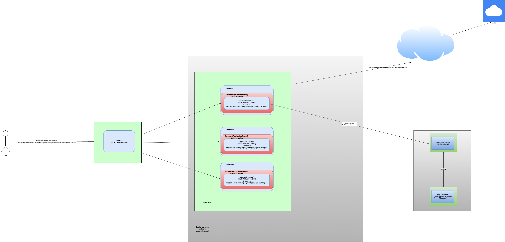

# popular-github-repos
[](https://github.com/reynierg/popular-github-repos/actions/workflows/ci.yml)

- [REQUIREMENTS](#requirements)  
- [ARCHITECTURE](#architecture)
- [DESCRIPTION](#description)
- [SOLUTION](#solution)
- [RUN](#run)
- [TROUBLESHOOTING](#troubleshooting)

# REQUIREMENTS
- Make
- Docker
- Docker compose

# ARCHITECTURE



# DESCRIPTION

popular-github-repos is a system that facilitates a user the discovery of the most popular repositories on GitHub. For that purpose, the system permits a user to do the following:
- Traverse over the list of the most popular repositories, sorted by the number of starts, in a descending order.
- Customize the page's size. The user will be able to change the number of repositories to be retrieved as part of every call to the WebAPI, through the query string parameter named **per_page**. The max allowed value will be 100.
- Filter, based on the programming language, created date, and any other of the available filters provided by the [GitHub API's Repositories Search endpoint](https://docs.github.com/en/search-github/searching-on-github/searching-for-repositories). Ex:
  - **q=language:Python** as part of the URL's query string parameters, will return the first page of the most popular Python repositories, sorted in descending order by a repository's count of stars.
  - **q=created:>2023-06-10** will return the first page of the most popular repositories that were created after the specified date.
  - **q=language:Python+created:>2023-06-10+** will return the first page of the most popular repositories that were created after the specified date and are related to Python.

# SOLUTION

- The solution was implemented as a RESTful API service using the [Python FastAPI framework](https://fastapi.tiangolo.com/lo/).
- It consists of two microservices: a RESTful API and a Redis server.
- Whenever a user invokes the corresponding API endpoint to retrieve a page of repositories' data, it will first try to find the data in the Redis server cache. Otherwise, the result will be retrieved from GitHub's WebAPI and persisted in Redis for X amount of seconds, which can be configurable.
- The WebAPI was implemented using async/await, taking into account that because the functionality is mainly I/O bound, the service will be able to handle more requests, if it releases the GIL preemptively, allowing other requests to be handled.
- Docker and Docker Compose is being used to containerize the WebAPI and Redis, and to be able to run both viably.
- Throughout the project, the use of a clean code paradigm was promoted, using Dependency Injection.
- A CI pipeline was set up to ensure that, once a PR or a Merge is done, on GitHub, in both the **develop** and **main** branches, some tests are automatically run and the source code is analyzed using linters to comply with industry code standards. After a merge, if all is well, a Docker image created from a Multi-Stage Dockerfile will be a pushed to Docker Hub.

# RUN


After having cloned the source code, 
```
git clone git@github.com:reynierg/popular-github-repos.git
```
and CD in the root directory of the project, 
```
CD popular-github-repos
```
you can start the application by running in a terminal the command
```
make up
```
After that all the services configured in Docker Compose will run, and you will be able to access the WebAPI, via the following URL:
```
http://0.0.0.0/docs
```
Where the API's OpeanAPI documentation can be inspected, and even the existing endpoint executed.
Currently, the API does not require either log in with a username and password or providing a token in order to access the API.
If you wish to check the data being cached in Redis, you can do so through the visual interface accessible at the following URL:
```
http://0.0.0.0:8081/
```
The username and password needed to log in can be obtained from the **docker-compose.yml** file.
Or better yet, make sure you change the user and password in your local copy, in the **docker-compose.yml** file, in lines 13 and 14 of the file.
Once you want to end the execution of the services running Docker Compose in the terminal, make sure to, after pressing **Ctrl + C**, run the 
```
make down
```
command, to make sure to remove the containers from your hard disk. 

# TROUBLESHOOTING

If you encounter any difficulty in running the application, such as if the following ports are already busy
```
0.0.0.0:8081
```
and 
```
0.0.0.0:80
```
modifiquelos en el fichero **docker-compose.yml**, on lines #16 and #25 respectively, and try to run the application again, by executing the command
```
make up
```